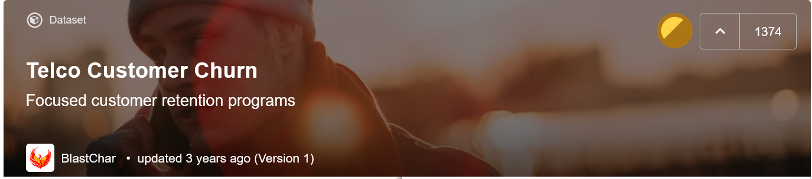
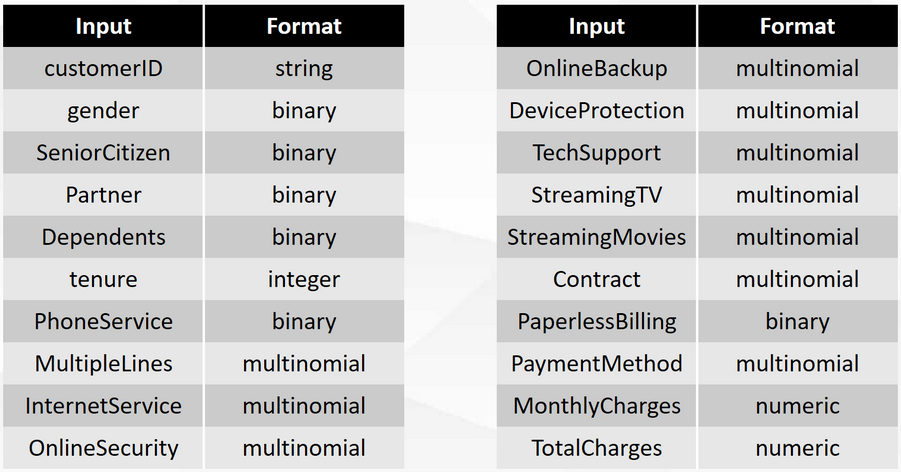
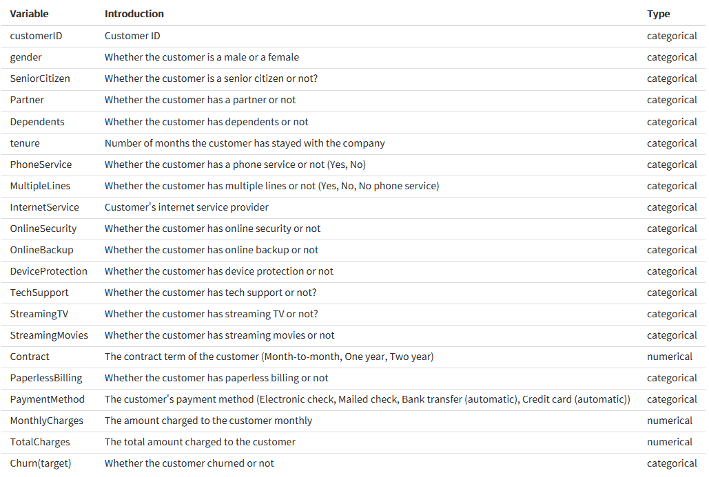

# [Group3] Prediction of Telco Customer Churn 

### Groups
* 陳采宗 統計三 107304004
* 沈冠宇 統計三 107304041
* 林盈盈 統計三 107304018
* 鄭雅云 統計三 107304020

### Goal
預測該客戶是否會流失
The goal is to predict whether the customer will be churn or not.

### Demo
Reproduce our result  
```R
Rscript model.R --fold 9 --input data.csv  --report performance.csv --predict predict.csv
```
* Online visualization
  * Shiny
  https://kennyshen880520.shinyapps.io/DataScienceFinalProject/

## Folder organization and its related information

### docs
* Your presentation, 1091_datascience_FP_group3.pdf, by **Jan. 12**
* Any related document for the final project
  * papers
  * software user guide

### data

* Source
  * Kaggle - Telco Customer Churn
  https://www.kaggle.com/blastchar/telco-customer-churn
  
* Input format
  * The whole data is a csv file.
  * Format of each input:
  

* Data features
  * customerID: Customer ID
  * gender: Whether the customer is a male or a female
  * SeniorCitizen: Whether the customer is a senior citizen or not (1, 0)
  * Partner: Whether the customer has a partner or not (Yes, No)
  * Dependents: Whether the customer has dependents or not (Yes, No)
  * tenure: Number of months the customer has stayed with the company
  * PhoneService: Whether the customer has a phone service or not (Yes, No)
  * MultipleLines: Whether the customer has multiple lines or not (Yes, No, No phone service)
  * InternetService: Customer’s internet service provider (DSL, Fiber optic, No)
  * OnlineSecurity: Whether the customer has online security or not (Yes, No, No internet service)
  * OnlineBackup: Whether the customer has online backup or not (Yes, No, No internet service)
  * DeviceProtection: Whether the customer has device protection or not (Yes, No, No internet service)
  * TechSupport: Whether the customer has technology support or not (Yes, No, No internet service)
  * StreamingTV: Whether the customer has streaming TV or not (Yes, No, No internet service)
  * StreamingMovies: Whether the customer has streaming movies or not (Yes, No, No internet service)
  * Contract: What kind of contract does the customer choose (Month-to-month, One year, Two year)
  * PaperlessBilling: Whether the customer uses paperless billing or not (Yes, No, No internet service)
  * PaymentMethod: What kind of payment method does the customer choose (Bank transfer, Credit card, Electronic check, Mailed check)

  * MonthlyCharges: The fee that customer pays every month.
  * TotalCharges: The total fee that customer pays
  * Churn: Whether the customer will be churn or not (Yes, No)
 
* Any preprocessing?
  * Handle missing data with package mice
  * Change (1,0) in column SeniorCitizen into (Yes, No)

### code

* Which method do you use?
  * Logistic Regression
  * Decison Tree
  * Random Forest
* What is a null model for comparison?
  * All output is 0 ,the model accuracy is 73%.
* How do your perform evaluation?
  * Split data into training, validation, and testing
  * K-fold cross validation

### results
* Which metric do you use
  * Accuracy
* Is your improvement significant?
  * 雖然經過反覆測試，但test_accuracy仍然無法突破0.8，但經過努力，我們解決了randomForest的overfittting的問題、logistic各個fold之間的accuracy也趨近穩定，0.8的accuracy遠大於null model，但可能已經是極限

* What is the challenge part of your project?
  * 無法突破原始 model的accuracy
  * feature大多都是類別型變數 操作空間不大
  * EDA觀察看出的趨勢並不等於model幫我們挑出的顯著變數
  * 使用stepwise挑選變數後依然無顯著提升
  
## References
* Code/implementation which you include/reference (__You should indicate in your presentation if you use code for others. Otherwise, cheating will result in 0 score for final project.__)
* Packages you use
  * library(mice)
  * library(rpart)
  * library(ggplot)
  * library(ggplot2)
  * library(randomForest) 
  * library(party)
  * library(shiny)

* Related publications
  * Telco Customer Churn
  https://www.kaggle.com/blastchar/telco-customer-churn
  * 我如何分析客戶流失預測？Kaggle比賽思路分享
  https://reurl.cc/3N1MgM
  * Shiny Data-Tables Demo 
  https://shiny.rstudio.com/gallery/datatables-demo.html

  


